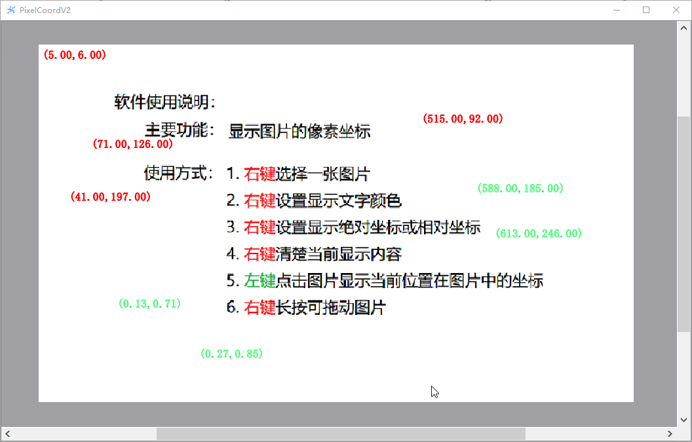
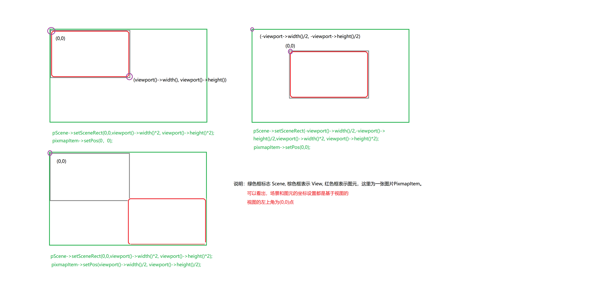

# Pixel Coordinates

## 说明

获取图片的相对或绝对坐标

## 功能

1. 打开软件后，鼠标右键选择图片
2. 鼠标左键点击要获取的坐标
3. 鼠标左键选择显示坐标类型，包括相对坐标和绝对坐标
4. 鼠标左键选择字体颜色
5. 滚轮放大
6. 右键按下拖动

## 演示视频

[跳转](https://www.bilibili.com/video/BV18a411Z7zN/?share_source=copy_web&vd_source=f06a9df5c06f51cc84a1106139be7062)

<iframe src="//player.bilibili.com/player.html?aid=258998462&bvid=BV18a411Z7zN&cid=787503785&p=1" scrolling="no" border="0" frameborder="no" framespacing="0" allowfullscreen="true"> </iframe>

## 显示

## 坐标映射

